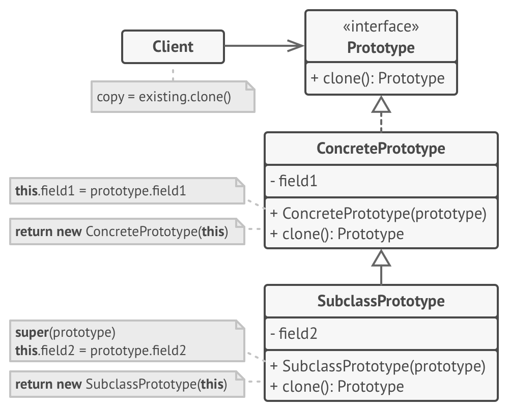

Prototype is a creational design pattern that lets you copy existing objects without making your code dependent on their classes.

**Basic implementation**

The structure of the Prototype design pattern

1. The Prototype interface declares the cloning methods. In most cases, it’s a single clone method.
2. The Concrete Prototype class implements the cloning method. In addition to copying the original object’s data to the clone, this method may also handle some edge cases of the cloning process related to cloning linked objects, untangling recursive dependencies, etc.
3. The Client can produce a copy of any object that follows the prototype interface.